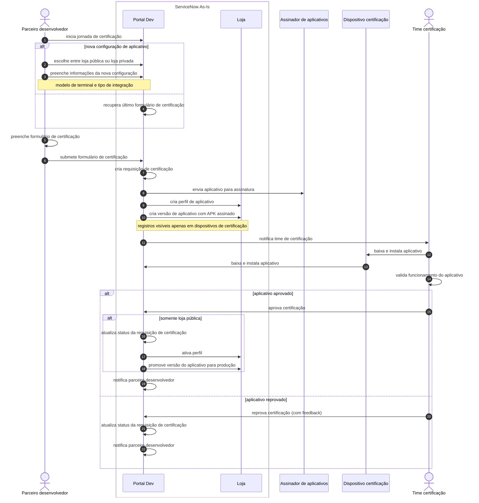

# AS-IS: Estado Atual do Ecossistema de Aplicativos

## Visão Geral

### Situação Atual

### Principais Sistemas Envolvidos
- **ServiceNow**: 
  - Gerencia TODA a jornada de aplicativos até aprovação/certificação
  - **Para "loja pública"**: Faz papel de LDM (distribuição para terminais) - **CONCORRE diretamente com LDM**
  - **Para "loja privada"**: Apenas certifica, distribuição B2B fica para LDM via processo manual separado
- **Assinador de aplicativos**: Serviço separado para assinatura digital de APKs
- **Dispositivos de certificação**: Terminais físicos para teste manual
- **LDM (Laranjinha Device Management)**: 
  - **MDM da empresa** - sistema especializado de distribuição B2B (outro time)
  - **Concorrência**: ServiceNow tenta substituir LDM para aplicativos de "loja pública"
  - **Processo B2B manual**: Interface separada entre times para distribuições "loja privada"

### Pontos de Dor Gerais
- **Repreenchimento total a cada nova configuração**: Mesmo aplicativo para modelo diferente de terminal ou tipo de loja = formulário completo novamente
- **Perfis inconsistentes na loja**: Mesmo aplicativo pode ter informações diferentes conforme modelo de terminal (devido ao preenchimento manual repetido)
- **Decisão confusa "loja pública vs privada"**: Parceiro deve escolher sem contexto claro sobre as implicações
- **Processo único para tudo**: Mesmo fluxo para aspectos técnicos (compatibilidade) e comerciais (vitrine)
- **Recertificação forçada para mudanças simples**: 
  - Mudar de "loja privada" → "loja pública" = nova jornada completa de certificação
  - Atualizar perfil comercial = nova jornada completa de certificação
  - Facebook v1.0 já certificado para Terminal A em loja privada → quer expor em loja pública = recertificar tudo novamente

---

## Definições e Conceitos Atuais

### Terminologia Usada Hoje
- **Requisição de certificação**: Processo único que engloba tudo (técnico + comercial)
- **Aplicativo/Perfil aplicativo**: Registro no ServiceNow que mistura metadados técnicos e comerciais
- **Versão de aplicativo**: APK assinado associado a uma requisição
- **Loja pública vs privada**: Conceito confuso que determina visibilidade final
- **Configuração de aplicativo**: Metadados técnicos (modelo terminal, tipo integração) cadastrados ad-hoc

### Atores Principais
- **Parceiro desenvolvedor**: Submete aplicativos e aguarda aprovações
- **Time de certificação**: Responsável por validação técnica E decisões comerciais
- **ServiceNow**: Sistema que concentra toda a lógica e dados
- **Assinador**: Serviço externo para assinar APKs

---

## Jornadas de Negócio Atuais

### 1. Jornada Única de Certificação (Engloba Tudo)

**Processo Atual:**
1. Parceiro acessa ServiceNow via portal/formulário web
2. **Nova configuração**: Escolhe "loja pública vs privada" + preenche modelo terminal e tipo integração
3. **Configuração existente**: ServiceNow recupera último formulário
4. Preenche formulário completo (dados técnicos + comerciais misturados)
5. Submete requisição de certificação
6. ServiceNow envia para assinatura + cria perfil aplicativo + versão
7. Time certificação testa manualmente em dispositivo
8. **Se aprovado + loja pública**: Promove direto para produção + atualiza vitrine
9. **Se aprovado + loja privada**: Apenas certifica (distribuição B2B separada via LDM)
10. Notifica parceiro do resultado

**Sistemas Envolvidos:**
- ServiceNow (processo completo)
- Assinador de aplicativos
- Dispositivos de certificação
- LDM (apenas para loja privada, processo separado)

**Problemas Identificados:**
- **Jornada monolítica**: Aspectos técnicos e comerciais no mesmo processo (evidência: um único formulário)
- **Recertificação desnecessária**: Mudar loja privada→pública requer nova certificação completa (evidência: escolha "loja pública vs privada" no início)
- **Inconsistência**: Mesmo app pode ter perfis diferentes por modelo de terminal (evidência: "nova configuração" refaz tudo)
- **Sem piloto**: Aprovação vai direto para produção (evidência: "promove direto para produção")
- **Processo bifurcado**: Loja pública (ServiceNow completo) vs privada (só certificação)

---

## Funcionalidades Atuais Disponíveis para Cliente da Maquininha

### Interface Atual da "Loja" no Terminal

**Funcionalidades Disponíveis:**

### 📱 **Interface Principal**
- **Barra de navegação horizontal** com três abas principais:

#### 🌟 **Aba "Destaques"**
- **Carrossel de imagens**: Banners promocionais rotativos
- **Lista de aplicativos relacionados**: Apps vinculados ao destaque atual
- **Interação**: Ao clicar em banner, exibe conteúdo específico do destaque

#### 🔍 **Aba "Apps"**
- **Barra de pesquisa**: Busca por aplicativos disponíveis
- **Tipos de busca disponíveis**:
  - **Nome do aplicativo**: Busca parcial por string
  - **Ramos e subramos**: Categorização por área de atuação
  - **Avaliação média**: Filtro por rating dos aplicativos
  - **Região de atuação**: Segmentação geográfica (Nordeste, Sudeste, etc.)
- **Lista de aplicativos**: Apps disponíveis para instalação

#### 📦 **Aba "Meus Apps"**
- **Lista de aplicativos instalados**: Apps já instalados no terminal
- **Funcionalidades de gestão**:
  - **Atualização**: Update para versões mais recentes
  - **Remoção**: Desinstalação de aplicativos

### ⚙️ **Menu Auxiliar (Hambúrguer)**
- **Localização**: Canto superior esquerdo
- **Opções disponíveis**:
  - 🔔 **Notificações da loja**: Avisos e atualizações
  - 📄 **Termos de uso**: Condições legais
  - ❓ **FAQ**: Perguntas frequentes
  - 🆘 **Ajuda**: Suporte ao usuário

**Limitações Atuais:**
- Interface básica do ServiceNow (não otimizada para mobile/terminal)
- Funcionalidades limitadas de descoberta de aplicativos
- Sem personalização por perfil de usuário
- Sem recomendações inteligentes

**Experiência do Usuário:**
- **Navegação simples**: 3 abas principais facilitam uso
- **Busca funcional**: Múltiplos filtros para encontrar apps
- **Gestão básica**: Instalação, atualização e remoção disponíveis
- **Suporte integrado**: FAQ e ajuda acessíveis
---

## Integrações Existentes

### APIs/Integrações Atuais
- **Assinador de aplicativos**: Integração para assinatura digital de APKs
- **Dispositivos de certificação**: Download manual de aplicativos via ServiceNow

### Protocolos de Comunicação
- APIs REST básicas entre ServiceNow e Assinador
- Integrações síncronas (sem processamento assíncrono)
- Protocolos ponto-a-ponto simples

### Limitações Técnicas
- ServiceNow como hub único
- LDM desconectado: processo separado para loja privada

---

## Dados e Informações

### Como os Dados São Armazenados Hoje
- **ServiceNow**: Banco único com tabelas customizadas 
- **Estrutura monolítica**: Dados técnicos e comerciais na mesma requisição de certificação
- **Sem separação**: Configuração de aplicativo, perfil comercial e versão técnica acoplados
- **Duplicação**: Mesmas configurações recriadas a cada nova requisição

### Qualidade dos Dados
- **Inconsistência**: Mesmo aplicativo com perfis diferentes por modelo de terminal (devido ao repreenchimento)
- **Dados misturados**: Aspectos técnicos e comerciais na mesma requisição

### Relatórios Disponíveis
- Status de requisições de certificação no ServiceNow
- Lista de aplicativos por parceiro
- Relatórios básicos de volume de certificações
- **Limitação**: Sem visibilidade de distribuição LDM para loja privada

---

## Principais Limitações e Problemas

### Operacionais
- **Jornada única para tudo**: Uma requisição mistura certificação técnica + perfil comercial
- **Repreenchimento**: Nova configuração = formulário completo novamente
- **Bifurcação de processo**: Loja pública vs privada têm fluxos diferentes

### Técnicos  
- **Testes manuais**: Time certificação valida manualmente em dispositivo físico
- **Promoção automática**: Aprovação técnica promove direto para produção (loja pública)

### De Negócio
- **Recertificação para mudança simples**: Loja privada→pública = nova jornada completa

---

## Oportunidades de Melhoria

### Separação de Responsabilidades
- **Desacoplar certificação técnica de perfil comercial**: Permitir mudanças comerciais sem recertificação
- **Sistemas especializados**: Portal técnico vs Portal comercial
- **Configurações reutilizáveis**: Catálogo de configurações pré-validadas

### Processo e Integração
- **Unificar distribuição**: ServiceNow e LDM trabalhando juntos, não competindo
- **Eliminar duplicação**: Reutilizar configurações existentes
- **Visibilidade completa**: Status unificado independente do tipo de loja
- **Flexibilidade**: Mudar loja privada→pública sem recertificação

### Experiência do Usuário
- **Decisão informada**: Explicar claramente implicações de loja pública vs privada
- **Formulários inteligentes**: Pré-popular com configurações existentes
- **Self-service**: Reduzir dependência de aprovações para mudanças simples
- **Consistência**: Mesmo aplicativo = mesmo perfil independente do modelo terminal

---

## Dependências e Restrições

### Sistemas Legados
- **ServiceNow**: Sistema crítico que não pode ser desligado abruptamente
- **Assinador de aplicativos**: Serviço externo com contrato específico
- **LDM**: Sistema de distribuição que deve continuar funcionando
- **Dispositivos existentes**: Terminais em produção devem manter compatibilidade

### Contratos/SLAs Existentes
- **Parceiros ativos**: Compromissos de certificação em andamento
- **Prazos de certificação**: SLAs informais que devem ser mantidos
- **Disponibilidade**: Sistema deve continuar operando durante migração

### Regulamentações
- **Assinatura digital**: Requisitos de segurança para APKs
- **Auditoria**: Necessidade de rastreabilidade completa
- **Compliance**: Padrões internos de governança devem ser mantidos

### Recursos Disponíveis
- **Time técnico limitado**: Capacidade de desenvolvimento restrita
- **Janelas de manutenção**: Disponibilidade limitada para mudanças
- **Orçamento**: Restrições financeiras para nova infraestrutura
- **Conhecimento especializado**: Curva de aprendizado em novas tecnologias