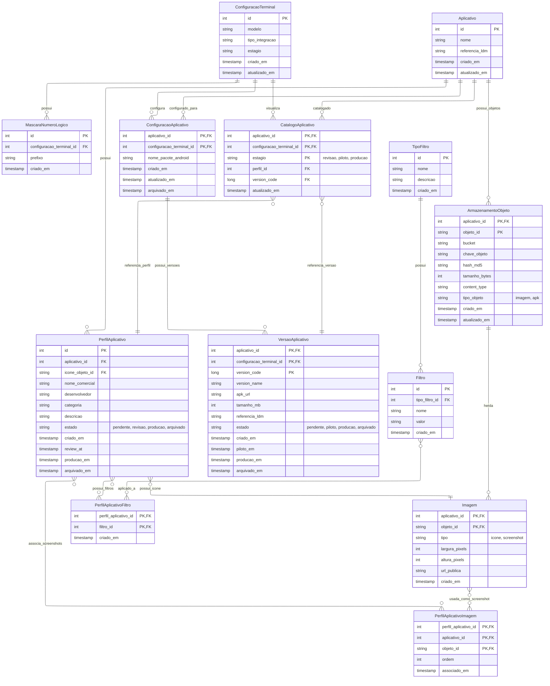
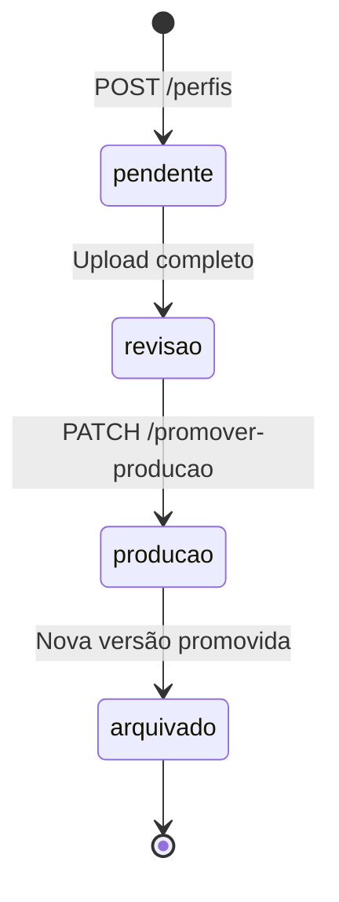
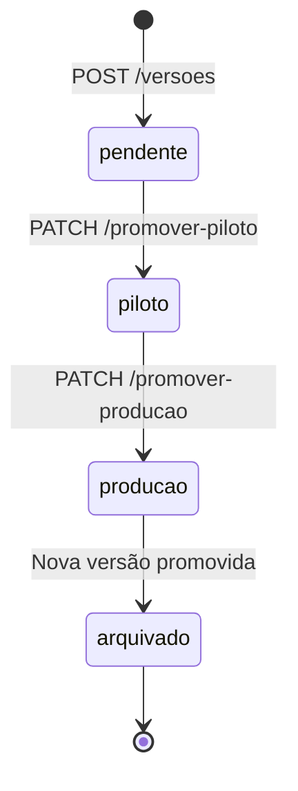

# Modelo de Dados - API Loja de Aplicativos

Este documento apresenta o modelo de dados derivado dos endpoints da API da Loja de Aplicativos.

## Diagrama Entidade-Relacionamento

**Constraint**: Apenas imagens do tipo 'screenshot' podem ser associadas via PerfilAplicativoImagem

## Chaves e Índices

### Chaves Primárias
- **ConfiguracaoTerminal**: `id`
- **MascaraNumeroLogico**: `id`
- **Aplicativo**: `id`
- **ConfiguracaoAplicativo**: `(aplicativo_id, configuracao_terminal_id)` - **Chave composta onde ambos campos também são FKs**
- **PerfilAplicativo**: `id` - **FK para ícone: icone_objeto_id → Imagem(aplicativo_id, objeto_id) onde aplicativo_id = PerfilAplicativo.aplicativo_id**
- **VersaoAplicativo**: `(aplicativo_id, configuracao_terminal_id, version_code)` - **Chave composta onde aplicativo_id e configuracao_terminal_id são FKs**
- **CatalogoAplicativo**: `(aplicativo_id, configuracao_terminal_id, estagio)` - **Chave composta onde aplicativo_id e configuracao_terminal_id são FKs**
- **TipoFiltro**: `id`
- **Filtro**: `id`
- **PerfilAplicativoFiltro**: `(perfil_aplicativo_id, filtro_id)` - **Tabela de junção M:N**
- **ArmazenamentoObjeto**: `(aplicativo_id, objeto_id)` - **Chave composta: aplicativo + identificador do objeto**
- **Imagem**: `(aplicativo_id, objeto_id)` - **Herda chave composta de ArmazenamentoObjeto**
- **PerfilAplicativoImagem**: `(perfil_aplicativo_id, aplicativo_id, objeto_id)` - **Tabela de junção M:N para reuso de imagens**

### Detalhamento das Chaves Compostas

#### ConfiguracaoAplicativo
- **PK**: `(aplicativo_id, configuracao_terminal_id)`
- **FK**: `aplicativo_id` → `Aplicativo.id`
- **FK**: `configuracao_terminal_id` → `ConfiguracaoTerminal.id`
- **Significado**: Uma configuração específica de um aplicativo para um modelo de terminal

#### VersaoAplicativo  
- **PK**: `(aplicativo_id, configuracao_terminal_id, version_code)`
- **FK**: `aplicativo_id` → `Aplicativo.id` 
- **FK**: `configuracao_terminal_id` → `ConfiguracaoTerminal.id`
- **FK**: `(aplicativo_id, configuracao_terminal_id)` → `ConfiguracaoAplicativo`
- **Significado**: Uma versão específica de um aplicativo para uma configuração de terminal específica

#### CatalogoAplicativo
- **PK**: `(aplicativo_id, configuracao_terminal_id, estagio)`
- **FK**: `aplicativo_id` → `Aplicativo.id`
- **FK**: `configuracao_terminal_id` → `ConfiguracaoTerminal.id` 
- **FK**: `(aplicativo_id, configuracao_terminal_id)` → `ConfiguracaoAplicativo`
- **Significado**: Entrada do catálogo para um aplicativo específico, configuração específica e estágio específico

#### ArmazenamentoObjeto
- **PK**: `(aplicativo_id, objeto_id)`
- **FK**: `aplicativo_id` → `Aplicativo.id`
- **Significado**: Objetos (imagens, APKs) organizados por aplicativo com identificador único

#### Imagem (Herança de ArmazenamentoObjeto)
- **PK**: `(aplicativo_id, objeto_id)` - **Herda chave composta**
- **FK**: `(aplicativo_id, objeto_id)` → `ArmazenamentoObjeto`
- **Significado**: Imagens com metadados visuais específicos

#### PerfilAplicativoImagem (M:N para Reuso)
- **PK**: `(perfil_aplicativo_id, aplicativo_id, objeto_id)`
- **FK**: `perfil_aplicativo_id` → `PerfilAplicativo.id`
- **FK**: `(aplicativo_id, objeto_id)` → `Imagem`
- **Significado**: Associação M:N permitindo reuso de imagens entre perfis sem perda de histórico
- **FK**: `perfil_aplicativo_id` → `PerfilAplicativo.id`
- **Constraint**: `tipo IN ('icone', 'screenshot')`
- **Regra**: 1 ícone obrigatório + N screenshots opcionais por perfil
- **Significado**: Imagens são objetos armazenados com metadados visuais específicos

### Índices Importantes
- **MascaraNumeroLogico**: `prefixo` (para lookup por número lógico)
- **PerfilAplicativo**: `(aplicativo_id, estado)` (consultas por estágio)
- **VersaoAplicativo**: `(aplicativo_id, configuracao_terminal_id, estado)` (consultas por estágio)
- **CatalogoAplicativo**: `(configuracao_terminal_id, estagio)` (consultas de catálogo)
- **ArmazenamentoObjeto**: `hash_md5` (deduplicação de arquivos), `(aplicativo_id, tipo_objeto)` (consultas por tipo)
- **PerfilAplicativoImagem**: `(perfil_aplicativo_id)` (imagens de um perfil), `(aplicativo_id, objeto_id)` (reutilização)

## Estados e Transições

### Estados do Perfil

### Estados da Versão

## Regras de Negócio

### Unicidade por Estado
- **Perfil**: Apenas 1 perfil por estado (pendente, revisao, producao) por aplicativo
- **Versão**: Apenas 1 versão por estado (pendente, piloto, producao) por configuração
- **Arquivados**: Múltiplos registros permitidos (histórico)

### Regras de Imagem
- **Ícone**: Exatamente 1 ícone obrigatório por perfil (FK: icone_objeto_id → Imagem(aplicativo_id, objeto_id) onde aplicativo_id = PerfilAplicativo.aplicativo_id e tipo='icone')
- **Screenshots**: 0 a N screenshots opcionais por perfil (via PerfilAplicativoImagem onde Imagem.tipo='screenshot')
- **Reuso inteligente**: Apenas screenshots podem ser reutilizados entre perfis (M:N)
- **Ícone exclusivo**: Cada ícone pertence a exatamente 1 perfil (1:N)
- **Herança**: Toda imagem herda de ArmazenamentoObjeto com chave composta (aplicativo_id, objeto_id)
- **Deduplicação**: Objetos com mesmo hash_md5 são reutilizados dentro do aplicativo
- **Organização**: Objetos isolados por aplicativo (não globais)

### Integridade Referencial
- **CatalogoAplicativo** sempre referencia perfil e versão existentes
- **Promoções** atualizam catálogo automaticamente (side effect)
- **ConfiguracaoAplicativo** deve existir antes de criar versões

### Constraints
- `version_code` deve ser único por `(aplicativo_id, configuracao_terminal_id)`
- `estado` deve ser valor válido do enum
- `estagio` no catálogo deve corresponder ao estágio da configuração do terminal
- `Imagem.tipo` deve ser 'icone' ou 'screenshot'
- **Ícone obrigatório**: `PerfilAplicativo.icone_objeto_id` NOT NULL
- **FK ícone válida**: `(aplicativo_id, icone_objeto_id)` deve existir em `Imagem` WHERE `tipo='icone'`
- **Screenshots únicos em M:N**: Apenas imagens `tipo='screenshot'` podem estar em `PerfilAplicativoImagem`
- **Ordem screenshots**: `ordem > 0` para screenshots via PerfilAplicativoImagem
- **Herança obrigatória**: `Imagem.(aplicativo_id, objeto_id)` deve existir em `ArmazenamentoObjeto`

## Observações Técnicas

### Tabela CatalogoAplicativo
- **Desnormalizada** para performance de consulta
- **Atualizada automaticamente** quando perfis/versões são promovidos
- **Indexada** por `(configuracao_terminal_id, estagio)` para consultas rápidas do terminal

### Version Code como PK
- **Semântico**: Usa version_code do Android como identificador natural
- **Composta**: Combinada com aplicativo e configuração
- **URLs mais limpa**: `/versoes/100` em vez de `/versoes/456`

### Arquitetura de Armazenamento
- **ArmazenamentoObjeto**: Camada base organizada por aplicativo (não global)
- **Chave composta**: `(aplicativo_id, objeto_id)` - objetos isolados por aplicativo
- **Deduplicação por hash**: Evita duplicação dentro do escopo do aplicativo
- **Herança por FK**: Imagem herda chave composta de ArmazenamentoObjeto
- **M:N para reuso**: PerfilAplicativoImagem permite reutilização sem perda de histórico
- **URLs pré-assinadas**: Geradas dinamicamente para upload/download seguro

### Benefícios do Reuso M:N
- **Histórico preservado**: Screenshots não são perdidos quando perfil é arquivado
- **Economia de storage**: Mesma imagem reutilizada entre perfis do mesmo aplicativo  
- **Versionamento flexível**: Perfil v2.0 pode reutilizar screenshots de v1.0
- **Gestão simplificada**: Upload uma vez, associa a múltiplos perfis

### Separação Perfil vs Versão
- **Perfil**: Metadados comerciais + associação M:N com imagens reutilizáveis
- **Versão**: Artefatos técnicos específicos por configuração de terminal (APK)