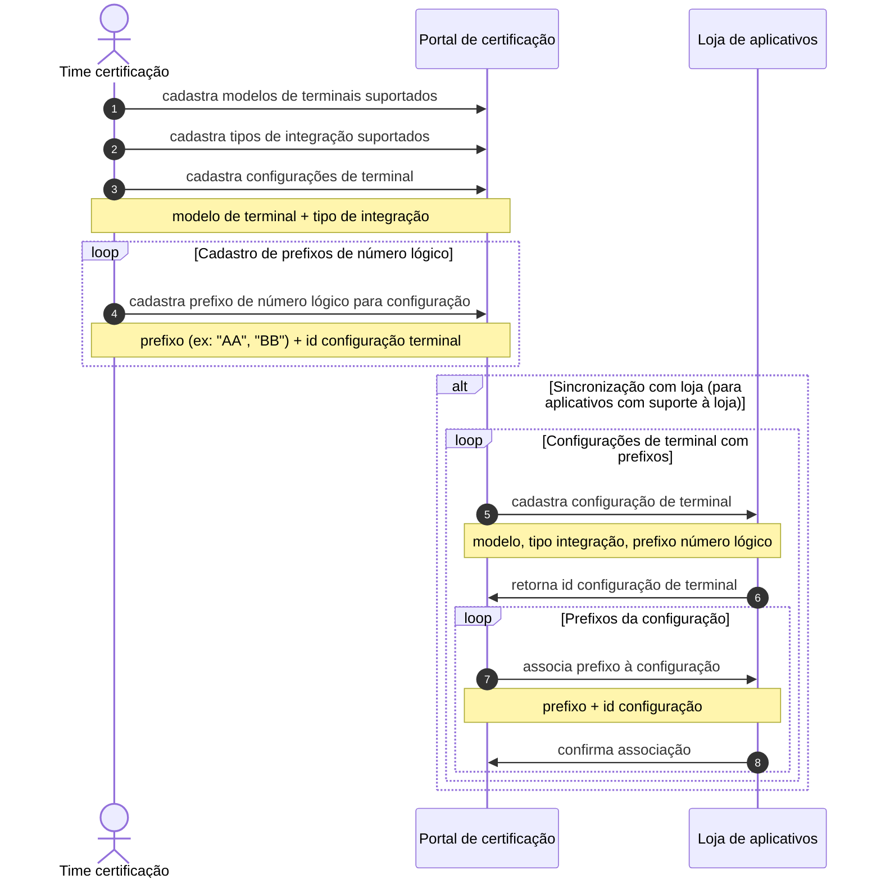
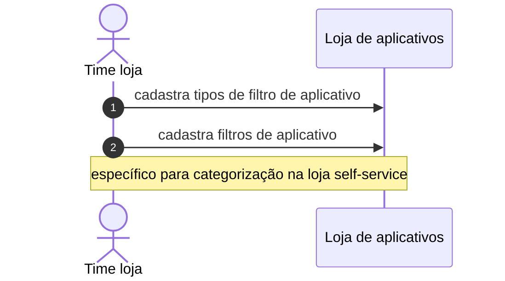
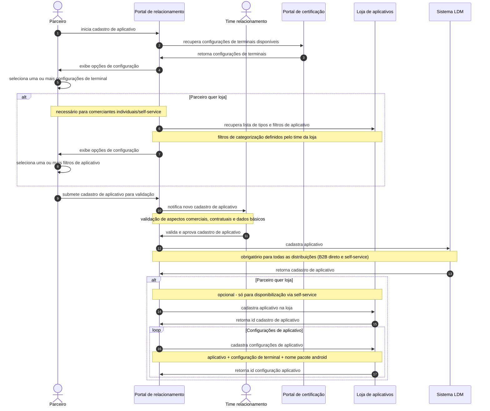
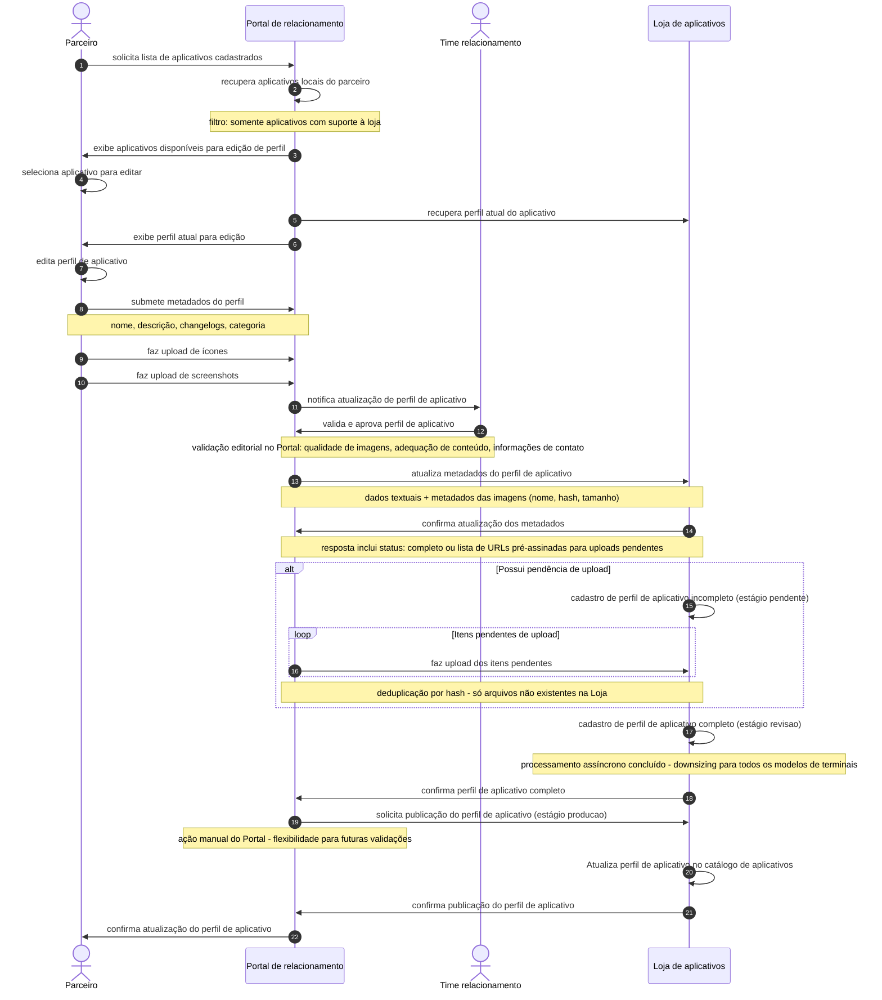
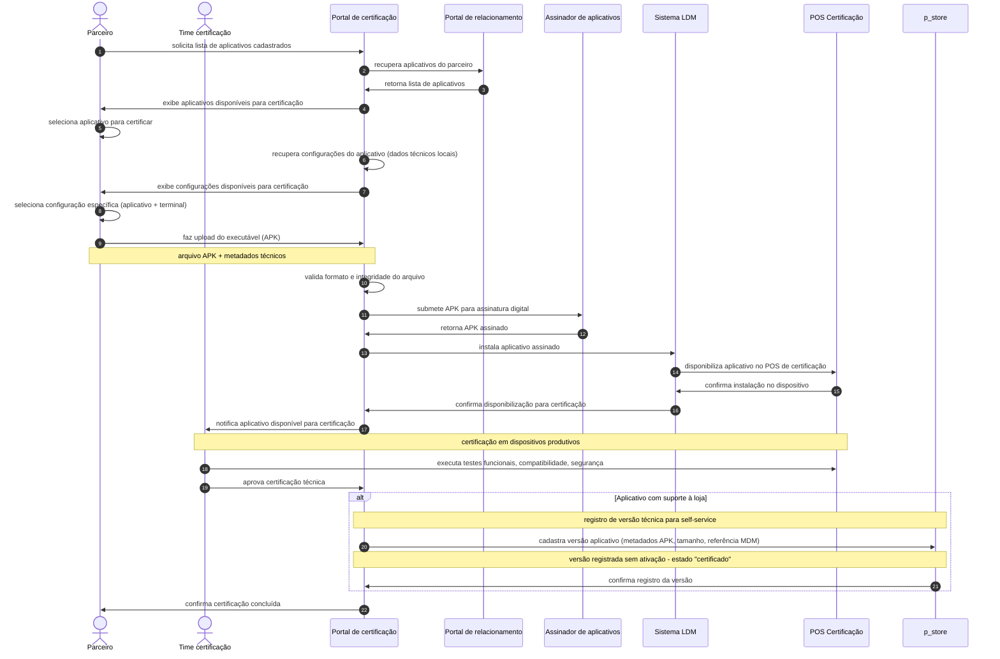
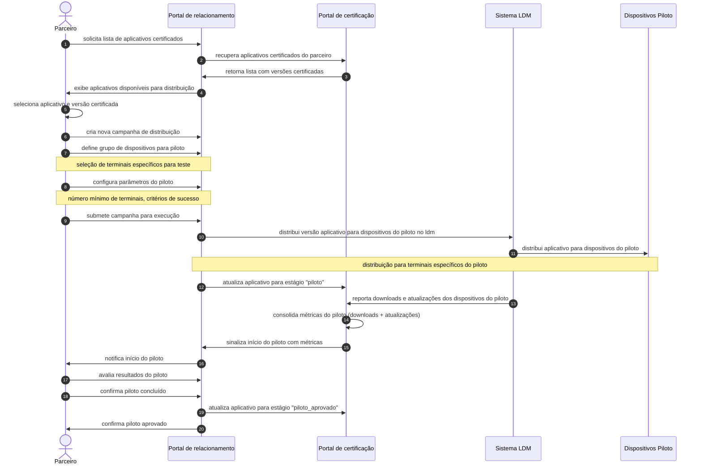
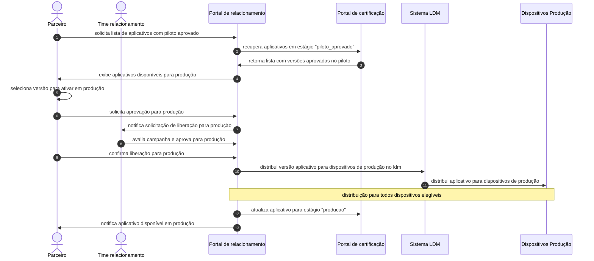
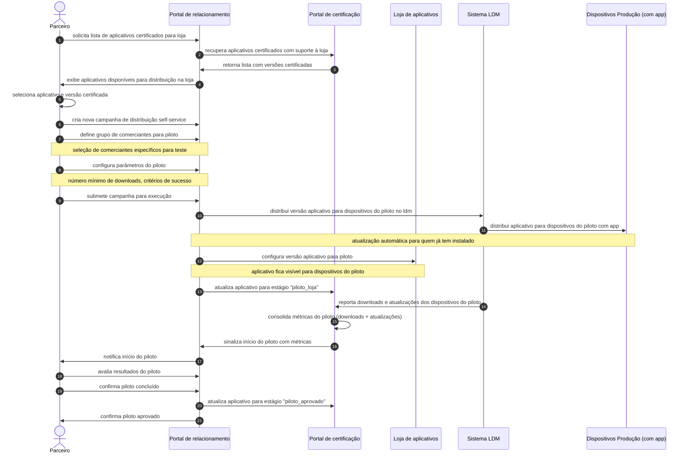
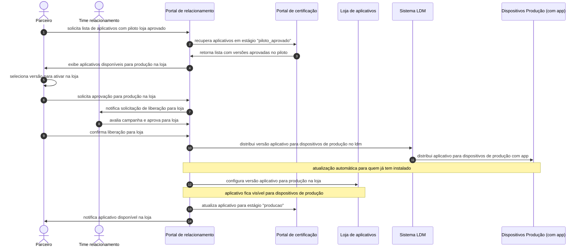
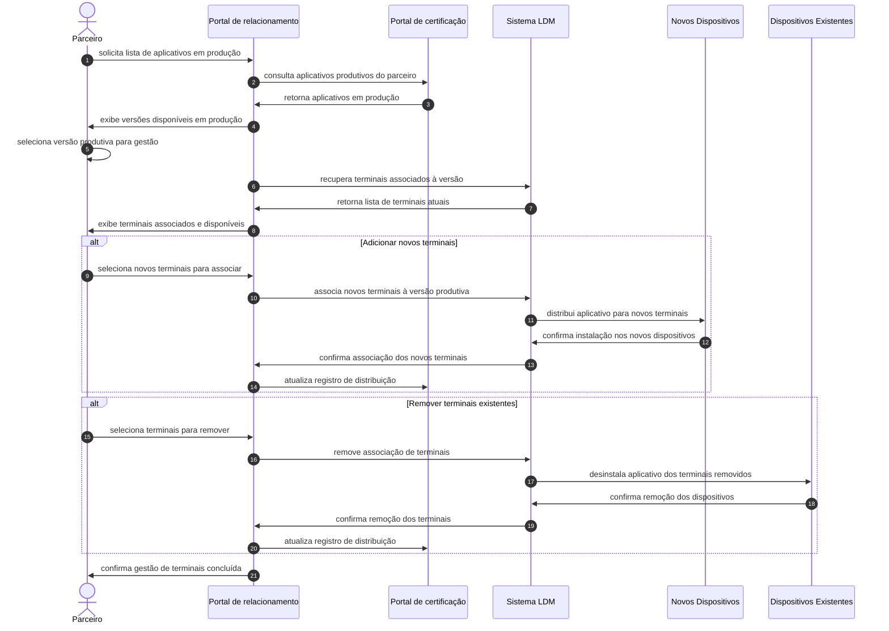

## Contexto ToBe

Vamos documentar a exposição da API de uma loja de aplicativos para dispositivos POS Android. Para melhorar o contexto, criaremos diagramas de sequência apresentando as jornadas pretendidas. Vamos começar descrevendo os atores e sistemas envolvidos:

### Atores
- **Parceiro**: Usuário de software de empresa parceira que pretende disponibilizar aplicativos integrados ao nosso aplicativo de pagamento.
- **Time relacionamento**: Responsável por gerenciar o relacionamento comercial com parceiros, validar aspectos contratuais e aprovar cadastros de aplicativos e perfis.
- **Time certificação**: Responsável por validar e certificar tecnicamente os aplicativos submetidos pelos parceiros.
- **Time loja**: Responsável por gerenciar a loja de aplicativos.

## Sistemas
- **Portal de relacionamento**: Sistema onde os parceiros gerenciam o relacionamento comercial, cadastram aplicativos e criam perfis de aplicativo para a loja. Interage com a loja de aplicativos e LDM.
- **Portal de certificação**: Sistema onde os parceiros submetem seus aplicativos para certificação. Interage com a loja de aplicativos e LDM.
- **Assinador de aplicativos**: Sistema externo responsável por assinar digitalmente os APKs submetidos para certificação.
- **Loja de aplicativos**: Sistema que exibe metadados dos aplicativos certificados para comerciantes individuais, funcionando como vitrine para seleção e download de aplicações.
- **Sistema LDM**: Sistema responsável pela distribuição e entrega dos aplicativos certificados para os dispositivos POS Android.
- **Dispositivos Piloto**: Grupo específico de dispositivos POS Android utilizados para testes controlados antes da liberação em produção.
- **Dispositivos Produção**: Todos os dispositivos POS Android elegíveis onde os aplicativos são instalados para uso pelos usuários finais.
- **Dispositivo POS Android**: Dispositivo onde os aplicativos certificados são instalados e utilizados pelos usuários finais.

## Jornadas

### Configuração do ambiente - cadastro de configurações técnicas

Configuração inicial das configurações técnicas, onde o time de certificação cadastra os modelos de terminais suportados, tipos de integração e configurações de terminais no Portal de certificação. Essas configurações serão utilizadas pelos parceiros durante o cadastro de aplicativos e certificações técnicas através de consultas diretas ao Portal de Certificação.

### Configuração do ambiente - cadastro de filtros

Configuração específica para a loja de aplicativos, onde o time da loja cadastra os tipos de filtro de aplicativo e filtros para categorização e organização dos aplicativos na loja self-service.

### Cadastro de aplicativo

Viabiliza o cadastro de um aplicativo por um parceiro com dois fluxos distintos: cadastro obrigatório no LDM para distribuição direta (grandes redes/B2B) e cadastro opcional na Loja para disponibilização via self-service (comerciantes individuais). O parceiro seleciona configurações de terminais (fornecidas pelo Portal de Certificação) e filtros de categorização (fornecidos pela Loja) apenas se optar pela loja. Após validação pelo time de relacionamento, o aplicativo é sempre registrado no LDM e, condicionalmente, na Loja conforme escolha do parceiro.

### Cadastro de perfil de aplicativo

Permite ao parceiro enriquecer o perfil de um aplicativo já cadastrado com suporte à loja, adicionando metadados para exibição como ícones, screenshots, descrições detalhadas, changelogs e outras informações visuais e descritivas que serão apresentadas aos usuários finais. O processo inclui validação editorial pelo time de relacionamento, otimização de storage através de deduplicação baseada em hash dos arquivos, processamento assíncrono das imagens para diferentes modelos de terminais, e controle manual de publicação para flexibilidade futura de validações adicionais.

### Certificação técnica

Permite ao parceiro submeter executáveis (APKs) para certificação técnica de aplicativos já cadastrados. A certificação é feita por configuração específica (aplicativo + modelo de terminal), onde cada configuração passa por validação técnica independente. O processo inclui upload do executável, validação de integridade, assinatura digital via sistema externo, instalação no POS de certificação via LDM, e testes funcionais em dispositivos produtivos pelo time de certificação.

**Registro automático na loja**: Para aplicativos que possuem suporte à loja (self-service), após a aprovação da certificação técnica, a versão do aplicativo é automaticamente registrada no sistema da loja com todos os metadados necessários (APK, tamanho, referências MDM). Esta versão fica no estado "certificado" - registrada mas não ativada - permitindo que seja posteriormente promovida através dos fluxos de gestão de perfil da loja.

### Distribuição em piloto (b2b)

Permite ao parceiro criar campanhas de distribuição para aplicativos já certificados, configurando grupos de dispositivos para pilotagem. O processo inclui seleção da versão certificada, definição do grupo piloto, distribuição automática via LDM, execução do piloto com número mínimo de terminais, validação dos resultados e confirmação da conclusão do piloto.

### Ativação em produção (b2b)

Permite ao parceiro ativar aplicativos que já passaram pelo piloto com sucesso, liberando-os para distribuição em todos os dispositivos elegíveis em produção. O processo inclui seleção de versões com piloto aprovado, aprovação conjunta do time de relacionamento, e distribuição automática via LDM para o ambiente produtivo.

### Distribuição em piloto (self-service)

Permite ao parceiro criar campanhas de distribuição para aplicativos já certificados na loja self-service, configurando disponibilização controlada para comerciantes selecionados. O processo é híbrido: comerciantes piloto sem o aplicativo verão a nova versão na loja substituindo a atual, enquanto comerciantes piloto que já possuem o aplicativo instalado receberão a atualização automaticamente via LDM.

### Ativação em produção (self-service)

Permite ao parceiro ativar aplicativos que já passaram pelo piloto na loja com sucesso, liberando-os para todos os comerciantes. O processo é híbrido: a nova versão substitui a atual na loja para todos os comerciantes sem o aplicativo, enquanto comerciantes que já possuem o aplicativo instalado recebem a atualização automaticamente via LDM.

### Gestão de terminais em produção

Permite ao parceiro gerenciar a distribuição de aplicativos já em produção para novos terminais, seja para atender novos clientes ou expandir a base de terminais de clientes existentes. O processo inclui seleção da versão produtiva, definição de novos terminais para associação, remoção de terminais quando necessário, e distribuição direta via LDM sem necessidade de pilotagem.

