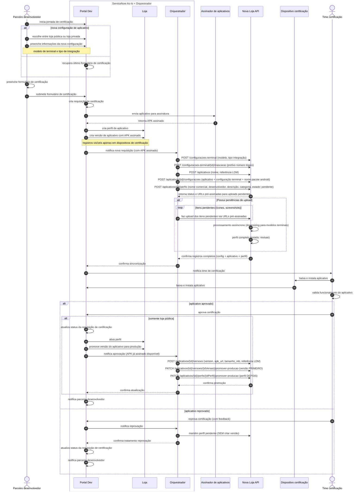

# Proposta de Jornada de Transição - Integração AS-IS + Nova Loja

## Visão Geral da Proposta

### Contexto
- **Jornada do parceiro**: Mantém-se inalterada (ServiceNow)
- **Backend da loja**: Novo sistema com APIs especializadas
- **Orquestração**: Camada intermediária para integrar AS-IS com novo backend
- **Funcionalidades**: Suporte às features atuais do cliente final

### Objetivos
1. **Preservar experiência atual** do parceiro (zero impacto)
2. **Melhorar backend** da loja com arquitetura moderna
3. **Manter funcionalidades** atuais do cliente da maquininha
4. **Viabilizar evolução futura** sem quebrar o existente

---

## Arquitetura de Transição Proposta


---

## Componentes da Solução

### 1. Orquestrador de Integração (Workflow ServiceNow)

**Implementação:**
- **Tipo**: Extensão do workflow existente "Gerenciamento de Aplicativo"
- **Integração**: Novos steps injetados nos pontos-chave do workflow atual
- **Execução**: Automática como parte do fluxo existente
- **Configuração**: Workflow Activities + Script Activities

**Responsabilidades:**
- **Sincronização automática**: ServiceNow → Nova Loja API
- **Mapeamento de dados**: Requisição ServiceNow → Entidades da Loja
- **Tratamento de erros**: Log e retry automático
- **Tradução de eventos**: Estados ServiceNow → Actions Nova Loja API

**Pontos de Injeção no Workflow:**
```yaml
# Ponto 1: Após criação da requisição
Workflow Step: "Requisição Criada"
Nova Activity: "Sincronizar com Nova Loja"
Ação: cadastrar configuração + aplicativo + perfil

# Ponto 2: Após aprovação técnica (loja pública)
Workflow Step: "Certificação Aprovada"
Nova Activity: "Promover na Nova Loja"
Ação: criar versão + promover perfil para produção

# Ponto 3: Após reprovação técnica
Workflow Step: "Certificação Reprovada"
Nova Activity: "Log Reprovação Nova Loja"
Ação: manter perfil em revisão (log motivo)
```

**Vantagens da Extensão:**
- ✅ **Zero impacto**: Workflow existente continua funcionando
- 🎯 **Pontos precisos**: Injeção apenas onde necessário
- ✅ **Visibilidade**: Logs no workflow atual
- 🔙 **Rollback fácil**: Pode desabilitar activities sem afetar fluxo principal

### 2. Nova Loja API (Backend)

**Funcionalidades Suportadas:**
- ✅ **Cadastro de aplicativos** via orquestração
- ✅ **Gestão de perfis comerciais** independente
- ✅ **Controle de versões** técnicas
- ✅ **Sistema de filtros** flexível (categorias, regiões)
- ✅ **Estados de publicação** (pendente → revisao → producao)

**Limitações Iniciais:**
- ❌ **Sistema de avaliações**: Não implementado na v1
- ❌ **Carrossel de destaques**: Feature futura
- ❌ **Notificações avançadas**: Sistema básico apenas

### 3. App Loja (Terminal) - Evolução

**Funcionalidades Mantidas:**
- ✅ **3 abas principais** (destaques, apps, meus apps)
- ✅ **Busca por nome** de aplicativo
- ✅ **Filtros por categoria** (via nova API)
- ✅ **Filtros por região** (via nova API)
- ✅ **Gestão de apps instalados**

**Funcionalidades Limitadas Temporariamente:**
- ⚠️ **Avaliação média**: Removida temporariamente (sem backend)
- ⚠️ **Carrossel dinâmico**: Simplificado (conteúdo estático)

---

## Mapeamento AS-IS → Nova Loja

### Estados e Fluxos

| AS-IS (ServiceNow) | Nova Loja | Observações |
|-------------------|-----------|------------|
| Requisição criada | Aplicativo + Perfil `pendente` | **Cadastro imediato** (sem versão) |
| Upload completo | Perfil `revisao` | **Processamento assíncrono** concluído |
| Em certificação | Perfil `revisao` + Aguardando | Aguardando aprovação técnica |
| Aprovado | Perfil `producao` + Versão `producao` | **Perfil revisao→producao + Versão criada** |
| Reprovado | Perfil mantém `revisao` | **Sem criar versão** (perfil fica para retry) |

### Fluxo de Dados Inteligente

**📋 Fase 1 - Cadastro (ANTES da certificação):**
```yaml
# 1. Configuração técnica primeiro
POST /configuracoes-terminal:
  - modelo: "A920"
  - tipo_integracao: "nativa"

# 2. Prefixo número lógico
POST /configuracoes-terminal/{idConfiguracao}/mascaras:
  - prefixo: "SW"
  
# 3. Aplicativo com referência LDM  
POST /aplicativos:
  - nome: "Facebook"
  - referencia_ldm: "ldm_app_123"

# 4. Configuração aplicativo + terminal
POST /aplicativos/{idAplicativo}/configuracoes:
  - aplicativo_id: {id}
  - configuracao_terminal_id: {id_config}
  - nome_pacote_android: "com.facebook.katana"

# 5. Perfil comercial
POST /aplicativos/{id}/perfis:
  - nome_comercial: "Facebook Business"
  - desenvolvedor: "Meta Inc"
  - descricao: "App para gestão comercial"
  - categoria: "redes_sociais"
  - estado: "pendente"
  - resposta: URLs pré-assinadas para uploads

# 6. Upload de imagens (se pendentes)
Loop para cada item pendente:
  - Upload ícone via URL pré-assinada
  - Upload screenshots via URLs pré-assinadas
  - Deduplicação por hash (só arquivos não existentes)
  - Processamento assíncrono (downsizing para modelos terminais)
  - Estado final: "revisao" (perfil completo)
```

**📋 Fase 2 - Certificação (SÓ se aprovado):**
```yaml
POST /aplicativos/{id}/versoes:
  - version: "1.0.0"
  - apk_url: "https://storage.../facebook-v1.0.0-signed.apk"
  - tamanho_mb: 25
  - referencia_ldm: "ldm_version_456"

# ORDEM CORRETA: Versão ANTES Perfil
PATCH /aplicativos/{id}/versoes/{idVersao}/promover-producao:
  - estado: "producao"
  - versão disponível para download (mas não visível)

PATCH /aplicativos/{id}/perfis/{idPerfil}/promover-producao:
  - estado: "revisao" → "producao"  
  - perfil fica visível na vitrine (versão já pronta)
```

**🎯 Benefícios:**
- 🏗️ **Configuração primeiro**: Base técnica antes do aplicativo
- 🔒 **Assinatura antecipada**: Sem dependência do orquestrador
- ✅ **Perfil existe** independente de certificação  
- ✅ **Sem lixo**: Versão só se tecnicamente válida
- ✅ **Rollback simples**: Reprovação não deixa rastros
- ✅ **Dados consistentes**: Estados sempre corretos

### Dados e Mapeamentos

| Campo AS-IS | Campo Nova Loja | API Endpoint |
|-------------|-----------------|--------------|
| Modelo terminal | `configuracao.modelo` | `POST /configuracoes-terminal` |
| Prefixo número lógico | `mascara.prefixo` | `POST /configuracoes-terminal/{id}/mascaras` |
| Nome aplicativo | `aplicativo.nome` | `POST /aplicativos` |
| Referência LDM | `aplicativo.referencia_ldm` | `POST /aplicativos` |
| Nome pacote Android | `configuracao_app.nome_pacote` | `POST /aplicativos/{id}/configuracoes` |
| Nome comercial | `perfil.nome_comercial` | `POST /aplicativos/{id}/perfis` |
| Desenvolvedor | `perfil.desenvolvedor` | `POST /aplicativos/{id}/perfis` |
| Categoria | `perfil.categoria` | `POST /aplicativos/{id}/perfis` |
| APK assinado | `versao.apk_url` | `POST /aplicativos/{id}/versoes` |
| Tamanho APK | `versao.tamanho_mb` | `POST /aplicativos/{id}/versoes` |
| Referência LDM versão | `versao.referencia_ldm` | `POST /aplicativos/{id}/versoes` |

---

## Fases de Implementação

### 📋 **Fase 1 - Foundation (MVP)**
**Objetivo**: Integração básica funcional

**Entregáveis:**
- **Workflow "Gerenciamento de Aplicativo" estendido**: 
  - Nova Activity: "Sincronizar com Nova Loja" (após requisição criada)
  - Nova Activity: "Promover na Nova Loja" (após aprovação técnica)
  - Nova Activity: "Log Reprovação" (após reprovação técnica)
  - Script Activities: Chamadas REST para Nova Loja API
- **Nova Loja API**: Endpoints básicos (aplicativos, perfis, versões, configurações)
- **Sistema de configurações**: Modelos terminais + filtros de categorização
- **App loja atualizado**: Consumindo Nova Loja API (sem avaliações inicialmente)

**Implementação Workflow:**
- Workflow Activities: Extensão de "Gerenciamento de Aplicativo" existente
- Script Activities: REST calls para Nova Loja API com tratamento de erro
- Workflow Variables: Mapeamento de dados ServiceNow → Nova Loja
- Error Handling: Log no workflow + rollback se necessário

**Duração**: 2-3 meses

### 📋 **Fase 2 - Feature Parity**
**Objetivo**: Paridade com funcionalidades AS-IS

**Entregáveis:**
- **Workflow expandido**: Tratamento de casos de borda + reconciliação
- Sistema de avaliações/reviews
- Carrossel dinâmico de destaques
- Notificações avançadas
- Relatórios e analytics

**Duração**: 2-3 meses

### 📋 **Fase 3 - Evolution** 
**Objetivo**: Funcionalidades além do AS-IS

**Entregáveis:**
- Recomendações inteligentes
- Personalização por usuário
- Analytics avançados
- Portal parceiro (futuro)

**Duração**: 3-4 meses

---

## Riscos e Mitigações

### 🚨 **Riscos Técnicos**

| Risco | Impacto | Mitigação |
|-------|---------|-----------|
| Latência na sincronização | Alto | Processamento assíncrono + retry logic |
| Inconsistência de dados | Alto | Transações distribuídas + reconciliação |
| Falha do orquestrador | Crítico | Alta disponibilidade + fallback para AS-IS |

### 🚨 **Riscos de Negócio**

| Risco | Impacto | Mitigação |
|-------|---------|-----------|
| Impacto na jornada parceiro | Crítico | Zero mudanças no ServiceNow |
| Degradação da UX cliente | Alto | Feature toggle + rollback rápido |
| Atraso na entrega | Médio | Fases incrementais + MVP first |

---

## Benefícios da Proposta

### ✅ **Imediatos**
- **Zero impacto** na jornada do parceiro
- **Melhoria na arquitetura** do backend
- **Base sólida** para evolução futura
- **Redução da dependência** do ServiceNow

### ✅ **Médio Prazo**
- **Flexibilidade** para novas funcionalidades
- **Performance melhorada** da loja
- **Facilidade de manutenção** e evolução
- **Preparação** para separação completa

### ✅ **Longo Prazo**
- **Migração gradual** dos parceiros
- **Portal independente** de certificação
- **Escalabilidade** do ecossistema
- **Time to market** reduzido para novas features

---

## Conclusão

Esta proposta permite **começar a evolução do backend da loja** mantendo **100% de compatibilidade** com o processo atual, criando a base para futuras melhorias sem riscos para o negócio.

O **orquestrador** é a peça-chave que viabiliza essa transição, permitindo que ambos os sistemas coexistam e evoluam de forma controlada.